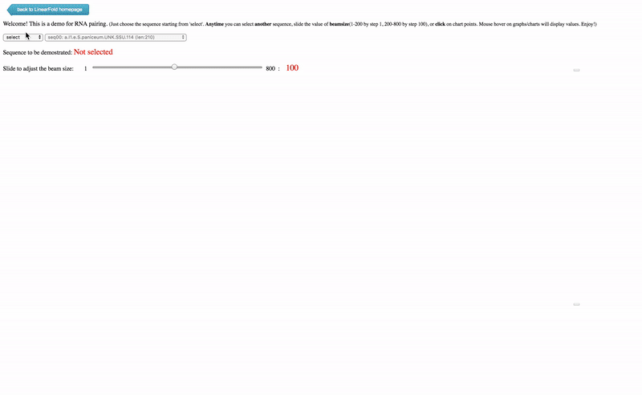

## LinearFold Server Project
   

A [web demo server](http://linearfold.eecs.oregonstate.edu) for linear-time prediction algorithm of RNA Secondary Structures
- [Interactive demo](http://linearfold.eecs.oregonstate.edu)
- [Preset demo](http://web.engr.oregonstate.edu/~liukaib/demo_json+canvas.html)
- **Interactive demo** and **Preset demo** have access to each other

