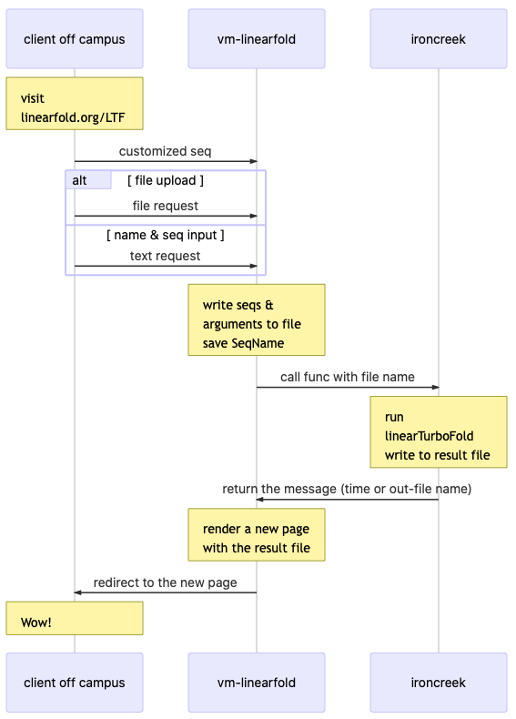

### Instruction for LinearTurboFold project

1. Install `conda`
2. In terminal
	1. [one time] create environment named ltf with conda
	```bash
  	cd linearLTF_package  # enter the working folder
	conda create --name ltf --file requirements.txt
	```
	2. [everytime for running] activate the ltf
	```bash
	conda activate ltf
	```
	3. [everytime after running] close the ltf env
	```bash
	conda deactivate ltf
	```
	4. [everytime for running] start the web server locally with this command
	```bash
	python linearfold_ltf.py
	```
  	then open website with url: http://127.0.0.1:5000
  
3. workflow of this framework after server starts(`python linearfold_ltf.py`):
	1. when you open the right url in browser, the python program renders the html file with the function `render_template('showResult_linearturbofold.html')`
	2. the html file reads the js file named `static/js/showLTF.js`
	3. `showLTF.js` will handle the content and display them in html

4. change code
	1. `static/js/showLTF.js` - `var _var =`: change the dict content when necessary
	2. `static/js/showLTF.js` - `function groupRes(...)`: change the layout of sequence and structure
	3. `static/js/showLTF.js` - `$("#res-show").html(groupRes(...));`: use `groupRes` function to create layout format and put it into element named `res-show`, which is rendered in the website http://127.0.0.1:5000


### 06/04/2021 Fri
1. how to use `groupRes` function
	1. this function is used to generate a long string, with html tags, to be filled in a position whose id is `#res-show`
	2. you can change the parameters of this function, currently it's `seqAA, seqNt, struc, textWid, tup,...`, you can use a dictionary like this:
	```javascript
	// dict, 
	// keys: seq1, seq2, seq3; value: a dict with seq and struc
	var data_dict=  {
	  "seq1": { "seq": 'AUCGGCA', "struc": '.((.).)' },
	  "seq2": { "seq": 'CUCGGCA', "struc": '.(.)..)' },
	  "seq3": { "seq": 'UUCGGCA', "struc": '.......' }
	      }
	//////////// or ///////////
	// list,
	// every element in the list is a dict with seq and struc
	var data_array = [
	  { "seq": 'AUCGGCA', "struc": '.((.).)' },   // seq1
	  { "seq": 'CUCGGCA', "struc": '.(.)..)' },   // seq2 
	  { "seq": 'UUCGGCA', "struc": '.......' },   // seq3
	]
	```
	so the function becomes `function groupRes(mydata, textWid)`
	
	3. if you follow my suggestion of `mydata_array`, then you can construct the long string in `groupRes` as below (just pseudocode, you need to verify the code):
	```javascript
	final_string = ''
	Lmax = data_array[0].seq.length
	pos_start = 0
	pos_end = textWid
	while pos_start < Lmax:
		for i_seq in 1..data_array.length

			sequence = data_array[i_seq].seq     // or data_array[i_seq]["seq"]
			structure = data_array[i_seq].struc  // or data_array[i_seq]["struc"]

			for letter in sequence[pos_start:pos_end]:
				final_string += '<markup>' + letter + '</markup>'
			final_string += '<br>'

			for letter in structure[pos_start:pos_end]:
				final_string += '<markup>' + letter + '</markup>'
			final_string += '<br>'
		pos_start = pos_end
		pos_end += textWid
	```
	
	4. some explanation:
		1. `markup` can be `<span class="..." id="...">` or other html element tag
		2. `sequence[pos_start:pos_end]` is array slicing


### 06/16/2021 Wed
1. align the layout with fixed width of seq name and anchor idx
2. highlight the letter
    1. add pairing info to `id` of span element for nucleotide/strcture letter, in `static/js/showLTF.js`
    ```bash
    stack_=[]
    ...((((((((((((((((.((....)))))))).))
       ++++++++++++++++ ++    --
       ^^^            ^ ^^    ^^
    012345.....      192021  2627

    when you reach pos 26, get a ')', pop stack_ ([3,4,5,.....,18,20,21]) from tail, got 21, 
    then you have (21,26), add it to a variable pairs_, now your stack_ is stack=[3,4,5,.....,18,20]

    when you reach pos 27, get a ')', pop stack_ ([3,4,5,.....,18,20]) from tail, got 20, 
    then you have (20,27), add it to a variable pairs_, now your stack_ is stack=[3,4,5,.....,18]
    ...
    pairs_ = [(21,26), (20,27),...]
    
    //construct sequence elements:
    21: <span class='res LTF1' id='seq1_21-26_A_('>A</span>
        <span class='res LTF1' id='stru1_21-26_A_('>(</span>
    26: <span class='res LTF1' id='seq1_26-21_U_)'>U</span>
        <span class='res LTF1' id='stru1_26-21_U_)'>)</span>
    20: ...;
    27: ...;
    ```

    2. highlight the pointed letter, the complementary pair, and their columns with same position, in `static/js/demo_tooltips.js`

        - add event listener like:
        ```js
        $('span').on('mouseover',  '.LTF1', function(e){ tooltip_on_for_pair(e, 'tooltipbox tooltipbox-sm tooltipbox-blue');  });
        $('span').on('mouseleave', '.LTF1', function(e){ tooltip_off(e); });
        ```
        - add a funtion named `tooltip_on_for_pair`, similiar to `tooltip_on`:
            - if you mouse on pos 21 of seq1, read `id` of the event: `var id_ = $(e.target).attr('id')`, `seq1_21-26_A_(`
            - extract pos `21` (where mouse on) and `26`(paired pos) from `id_`
            - reconstruct the `id` for 12 elements:  (seq`1`/`2`/`3` + stru`1`/`2`/`3`) * (pos`21`/pos`26`)
            - add class name "myhover" to them

    3. change highlight style on your preference, in `static/css/showCircle_with_boots.css`
    ```css
    // change color for tooltipbox
    .tooltipbox-red         { background: rgba(179, 41, 48, 0.85) !important;}
    .tooltipbox-red:after   { border-top: 10px solid rgba(179, 41, 48, 0.85);}

    .tooltipbox-grey        { background: rgba(128,128,128, 0.85) !important;}
    .tooltipbox-grey:after  { border-top: 10px solid rgba(128,128,128, 0.85);}


    // change color for pointed letter/parentithis
    .LTF1{ color: black!important;}
    .LTF1:hover, .myhover{
      cursor: pointer;
      background:grey;
      color:white!important;
    }

    .LTF2{ color: red!important;}
    .LTF2:hover, .myhover2{
      cursor: pointer;
      background:red;
      color:white!important;
    }
    ```


### 07/01/2021 Thu
This week's target: user defined region display with starting index input  
> user input: 5000-5300   
> how many - before 5000? e.g. 100, and 50 between 5000 and 5300     
> then the new idex should be 5100   
>    
> starting postion:   
> ori_idx1: 5000   
> new_idx1: 5100 (100 more)   
>    
> ending postion:   
> ori_idx2: 5300   
> new_idx2: 5450 (100+50 more)  

> get the user_seq from the whole seq (0-30,000) with slicing [5100,5450]   


1. Please refer to covseq sample [page](http://covseq.baidu.com/upload/res_1625179268.3289835_sample1-SARS-CoV-2_WA6-UW3_human_2020_USA)
2. Use long sequence data from Sizhen
	1. hard code in js, or read data from file
	2. pre-process data, generate a mapping from old_idx to new_idx by insertion/deletion in alignment
3. Add two text boxes for users, and one click button to confirm input & triger update, e.g. `#typePos1` and `#typePos1`
	1. html sample
	```
	Start: <input type="text" id="typePos1" name="typePos1" size=5> 
	End: <input type="text" id="typePos2" name="typePos2" size=5> 
        <button type="button" class="btn btn-primary btn-sm" onclick="applyRange()">Apply Range</button>
	```
	2. define `applyRange()` in js script like:
	```
	var old_index1=parseInt($('#typePos1').val());
	var old_index2=parseInt($('#typePos2').val());
	// get new_index1 and new_index2 
	// slice the region [new_index1, new_index2] from raw sequences 
	// display and highlight them with your existed scripts
	```
### 08/14/2021 Sat

1. fix bug for the shink function: instead of shink range, just replace all the unpaired `(` and `)`
```js
//      case 1               case 2
// ..((((..)..))))     ..((((....))))...(..
//               ^                      ^

function shink(startidx, endidx, stru){
  leftidx = [];
  toreplace = [];
  stru_lst = stru.split('');

  for (var i=startidx; i<=endidx; i++){  //read the structure from left to right	
    if (stru[i] == '(')
      leftidx.push(i);
    else if (stru[i] == ')'){
      if (leftidx.length == 0){ // case 1, empty stack, you get an unpaired ")"
        toreplace.push(i);
      }else{
        ii = leftidx.pop();  // you get a pair [ii,i]
      }
    }
  }

  toreplace.concat(leftidx); // case 2, if there is any left idx left, add them to to replace
  for (var i=0; i<toreplace.length; i++){
    stru_lst[i] = '.'
  }  
  return stru_lst.join('');
}

// same range, but filtered structure

```


### 08/27/2021 Fri
- **vm-linearfold** server: process front end data from user, send request to ironcreek, receive result, and sent result back to user
- **ironcreek** server: backend heavy calculation



##### To-do this week
1. run linearTurboFold on flip or ironcreek, check the output file (line layout and other format)  
2. possibly change your layout rendering script based on the LTF program's output  
3. setup 2 pages: input page and result page(from your current layout rendering page)  
	1. input page: modified from templates/interface_linearfold_v.html
	2. result page: you almost already finished


### 09/03/2021 Fri

##### To-do this week

1. modify LTF input page, add necessary parameter  (beam1, beam2, N_iterations, etc) for user to input/select, test the page on your laptop
2. check `<yourID>@vm-linearfold.eecs.oregonstate.edu:/scratch/webroot/linearfold_wsgi/server_flask_socketClient.py: line 473`
	1. copy the file to your laptop, or your home dir on OSU server, before editting
	2. this part processes the data from user and runs backend program with the data, which can be triggered with either browser or server scripts:
		1. browser route `demoURL` with `POST/GET` method
		2. python function `inputSeq()` from other functions
3. copy from above part, generate a new function for LinearTurboFold job submission
	1. route url: same with LTF input page, with `POST/GET` method
	2. function name: name it yourself, should avoid duplicate of any other function names
	3. read all necessary parameters for LTF from input page (beam1, beam2, N_iterations, etc) with `flask.request.form[<key>]`, put all info (seqName1, seq1, seqName2, seq2,..., parameters) into a userFile, like `line 567-571` do
4. borrow the idea from `LF_v_core`(line 169) and `request_ironcreek_v`(line 171). Since you will use the LTF output file in your final result page instead of parsing the LTF output here, just combine them and simplify them as a new function `request_ironcreek_LTF` used in above function. port2 can be `11118`
5. test the `request_ironcreek_LTF` function with test case on OSU server, paste either successful or error message in Sizhen's doc


#### Validate user's sequence data 

- if user uploads a file: `if 'seqFile' in flask.request.files and flask.request.files['seqFile'].filename != u''`, then read content of user's upload
- if user types text: `lines = text.split('\n')`, then parse the content of user's input
then validate name and sequence info for each seq, from above data


### 09/17/2021 Fri
##### request_ironcreek
- listening process on ironcreek side is finished (`ironcreek:/scratch/liukaib/server_ironcreek_socket/server_socket_ltf.py`)
- test following python script in your folder on OSU machine, to communicate with ironcreek, the returned `t` is the file path you can use in the result page
```py
import socket

def request_ironcreek_ltf(seqfile_prefix):
    s2 = socket.socket()         # creat socket object
    host = 'ironcreek.eecs.oregonstate.edu'
    port2 = 11118                # set port

    s2.connect((host, port2))
    #seqfile_prefix_s = bytes(seqfile_prefix,'UTF-8')
    s2.send(seqfile_prefix)
    t2 = s2.recv(1024)

    s2.close()

    return t2


if __name__ == '__main__':
    seqfile_prefix = '/nfs/stak/users/liukaib/public_html/usrData/test_ltf'
    t = request_ironcreek_ltf(seqfile_prefix)
    print(t)
```
